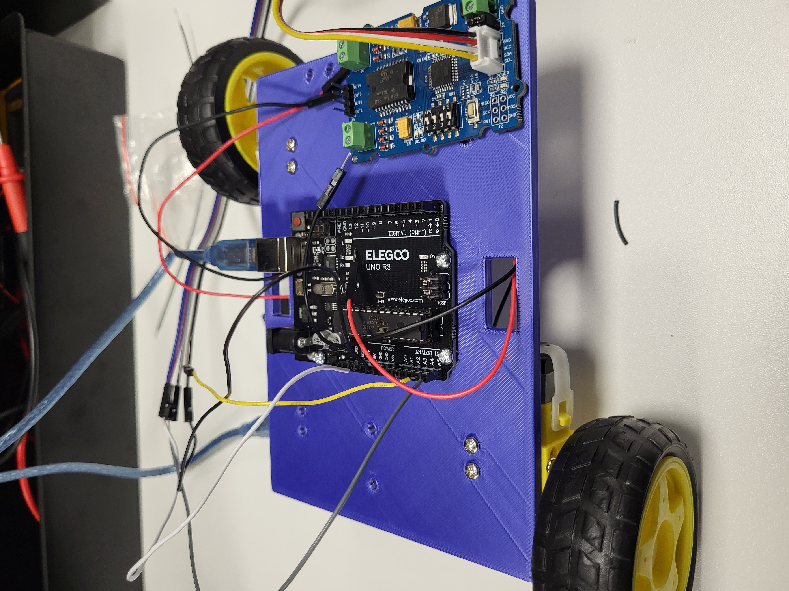
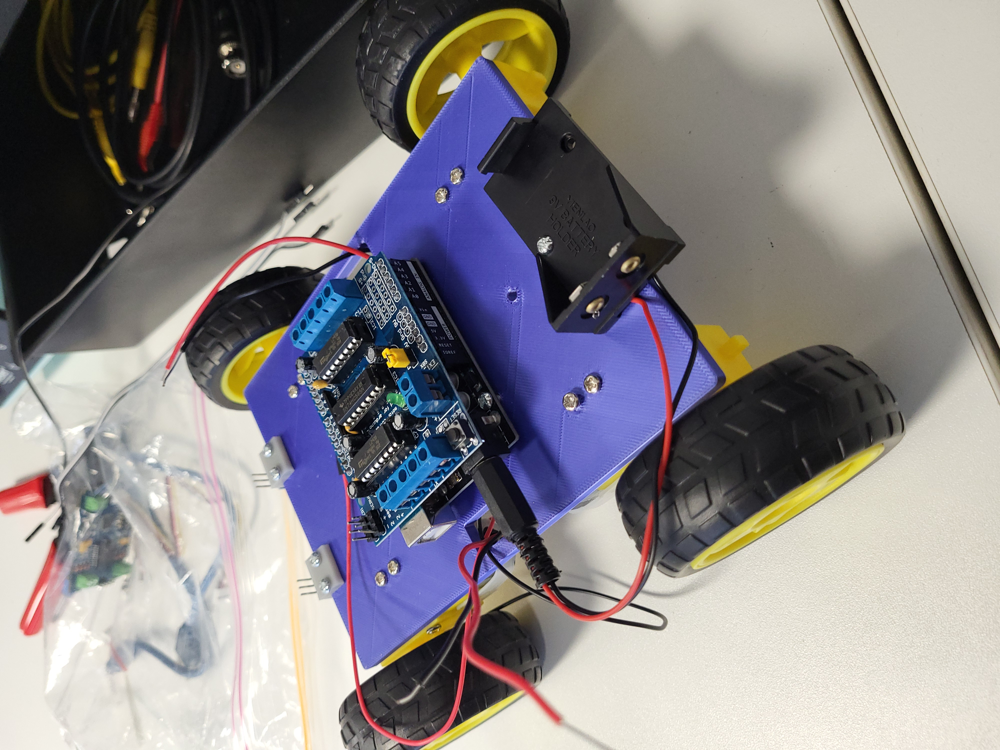

# 4WD Modular Robot Vehicle
## Overview
This project is a four-wheel drive robot built using an ELEGOO Arduino Uno R3, an L293D Motor Shield, and an HC-05 Bluetooth Transceiver module. It can be controlled with the following sketches/scripts.

## Sketches/Scripts
1. **Move_Car_Forward:**
Simple test sketch that continuously drives the robot forward to verify motor wiring, power, and motor shield functionality.

2. **LineFollowingRobot:**
Uses left and right infrared sensors to detect and follow a line autonomously (Code from [lee_curiosity](https://projecthub.arduino.cc/lee_curiosity/building-a-line-following-robot-using-arduino-017dbb))

4. **Line-Following_Robot:**
Uses left and right infrared sensors to detect and follow a line autonomously.

5. **Remote_Controlled_Car(Wired):**
Control the robot from a computer using a Python WASD controller program (Remote_Control_Car) and a USB serial connection.
   
7. **Remote_Controlled_Car_Wireless(Wireless via Bluetooth):**
Control the robot wirelessly from a computer using an HC-05 Bluetooth module and a Python WASD controller program (Remote_Control_Car).

## Hardware 
### Components
- Arduino Uno R3
- L293D Motor Shield
- HC-05 Bluetooth Module
- 4 DC Motors
- 4 Tyres & Wheels
- 2 IR Sensors
- 3D-Printed Chassis
- 9V Battery Pack
- Jumper Wires

## Observations
During development several common robotics issues were encountered:
- Motor orientation requires calibration.
- Bluetooth pairing does not always mean a serial connection is active.
- SoftwareSerial and motor shield timing can conflict.
- Testing individual subsystems (motors, Bluetooth, power, control logic) simplifies debugging.

## Future Improvements
- PID control
- Bluetooth joystick control
- Mobile app interface
- Obstacle avoidance
- Camera streaming
- Autonomous navigation
- Sentry Turret

## Images

